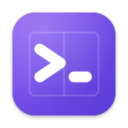
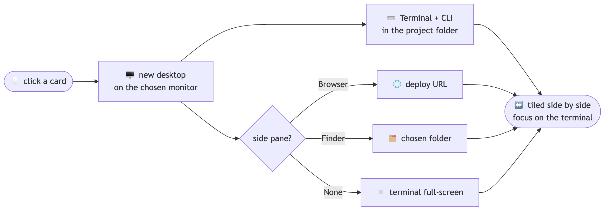

<div align="center">



# loadcli

### Your entire dev environment — in **one click**.

Pick a project and `loadcli` sets the stage: a **new desktop** on the right monitor, the **Terminal** already running your **CLI** in the project folder and, beside it, **whatever that project needs** — the browser at the deploy URL, a Finder folder, or nothing. All positioned, without you touching a thing.

Every card is a `LOADCLI.md` living **inside the project folder**, so your cards travel with your folders — sync `~/DEV` and every Mac shows the same grid.

**English** · [Português](README.pt-BR.md) · [中文](README.zh-CN.md)


</div>

---

## 😮‍💨 The chore it kills

Every time you sit down with a project it's the same ritual: open the Terminal, `cd` into the right folder, fire up the CLI, open the browser at the deploy, spin up a fresh desktop so you don't clutter the others, drag and resize windows… times **dozens of projects**, ten times a day.

`loadcli` turns that ritual into **one click on a card**.

```
┌───────────────────── new desktop · chosen monitor ──────────────────────┐
│                                    │                                     │
│     🌐  Browser (deploy URL)        │        ⌨️   Terminal + CLI           │
│     🗂️  or a Finder folder          │        cd ~/DEV/my-project          │
│     ▫️  or nothing (full screen)    │        $ claude                     │
│                                    │                                     │
└────────────────────────────────────┴─────────────────────────────────────┘
        pane on the left                    terminal on the right, focused
```

---

## 🎬 What one click does

<div align="center">



</div>

Every window is **verified** — `loadcli` checks it actually landed on the new desktop and fixes it if it didn't — and the **focus ends on the terminal**, ready for you to type.

---

## ✨ Highlights

- 📄 **Cards come from the folders** — a `LOADCLI.md` inside each project folder *is* the card. Register your project folders once and the grid builds itself, on every machine.
- 🖥️ **One desktop per project** on the monitor you pick (monitor picker when you have 2+ screens).
- ⌨️ **Terminal + CLI** already in the right folder — Terminal.app or iTerm.
- 🔤 **Auto font bump** — after focusing the terminal it presses ⌘+ a set number of times (**1–20, default 7**) so the text isn't tiny (set it in Settings).
- 🧩 **Per-project side pane:**
  - 🌐 **Browser** at the deploy URL (Chrome, Brave, Edge, Arc, Safari)
  - 🗂️ **A Finder folder** — tiled just like the browser
  - ▫️ **Nothing** — terminal only, **maximized or native full screen** (its own Space)
- 🖱️ **Click to select, double-click to start** — plus one-tap buttons on every card for the project **folder**, **website**, **repository** and editor.
- 🔎 **Quick search** — type and the folders holding matches open themselves; clear it and they all close again.
- 🕘 **Recents tab** — the projects you opened last, newest first.
- 📁 **Folders** — group cards by the `grupo:` key in their document; folders **start collapsed on every launch** for quick scanning.
- 🤖 **Per-project CLI** — Claude Code, Codex or a custom command, each with its own **model and _effort_** (e.g. `opus` + `ultracode`).
- ↔️ **Automatic split** with adjustable ratio.
- 🧭 **Menu bar launcher** — start any project (grouped by folder, plus a Recents submenu) without opening the main window.
- 🩺 `loadcli --doctor` — self-test of the desktop mechanism on every monitor.
- 🍎 **100% native** — SwiftUI, custom icon, About panel, Settings.

---

## 📄 The card lives in the project folder

There is no central database of projects. Each project carries a **`LOADCLI.md`** in its own folder, and that file *is* the card. In **Settings › Project folders** you register the roots you keep code in (`~/DEV`, a Drive folder, whatever); `loadcli` walks them, finds those documents and builds the grid from what they say.

```markdown
---
loadcli: 1
id: 6C0F2A18-3D4B-4E71-9A02-1F5C8B3E77D9
nome: Acme Site
grupo: Clients
icone: cart.fill
cor: "#3B82F6"
repositorio: https://github.com/you/acme
url: https://app.acme.com
cli: claude
modelo: opus
esforco: xhigh
painel: browser
---

The Acme store. Deployed on Vercel, database on Neon.
```

- **No absolute path is ever written.** The project folder is simply wherever the document sits — so the same file works on any Mac, under any username.
- **Sync-friendly by design.** Put `~/DEV` on Google Drive or ownCloud and every machine shows the same, always-current cards. Nothing to register twice.
- **Yours to edit.** Keys you add by hand and the markdown body (which becomes the card's description) survive every rewrite. Portuguese and English key names are both accepted.
- **Fast every time but the first.** The last scan is cached, so the window paints instantly and the walk happens in the background — you see new cards appear a moment later.
- **Nothing disappears.** A root that can't be read (a Drive that hasn't synced yet) keeps its cached cards instead of emptying the grid.

Deleting a card moves its `LOADCLI.md` to the Trash — the project folder and everything in it are never touched.

---

## 🧠 The hard part: creating Spaces **without disabling SIP**

Creating a desktop (Space) through a private API (SkyLight) **doesn't work** in a normal modern-macOS app — which is why tools like *yabai* ask you to **turn off SIP**. `loadcli` sidesteps that.

It creates the desktop **the way a human would**: it drives the **Mission Control “+” button** through the **Accessibility API**, using the Dock's stable identifiers (`mc.spaces.add`) and targeting the monitor by its `AXDisplayID` — the same path Hammerspoon's `hs.spaces` uses. Creation is confirmed by a **space-ID diff** (SkyLight, read-only).

To **enter** the new desktop (the Accessibility click on the thumbnail is ignored on macOS 26, and switching via the private API leaves the screens overlapping), it again does what a person would: a **real click** on the desktop's thumbnail in Mission Control — a clean transition, focus on the right monitor — **always verifying** the result.

> **SIP stays intact. No daemon. No kernel hack.** Just Accessibility and Apple Events — the same permissions you grant any automation app.

Details in [`docs/ARCHITECTURE.md`](docs/ARCHITECTURE.md).

---

## 🚀 Getting started

**Prerequisites:** macOS 14+, **Xcode** and **Homebrew**.

> 🧪 **Tested on macOS 26.3 (Tahoe).** The deployment target is macOS 14, but the desktop-creation flow has only been validated on macOS 26 — on 14/15 the Mission Control internals differ, so behavior there is unverified.

```bash
git clone https://github.com/<your-user>/loadcli.git
cd loadcli
make bootstrap     # installs xcodegen, xcbeautify, create-dmg
make run           # generates the project, builds and opens the app
```

On first run macOS asks for **two permissions** (see below). Then open **Settings › Project folders**, add the folder your code lives in (`~/DEV`, say) and the cards appear on their own — or click **New Project** to scaffold a folder, write its `LOADCLI.md` and open the terminal in it, in one step.

> Coming from an earlier version? The first launch migrates automatically: a `LOADCLI.md` is written into each registered project folder, the scan roots are seeded from them, and the old `projects.json` / `folders.json` are kept as `.bak`.

<details>
<summary>Other <code>make</code> targets</summary>

```bash
make gen           # generates loadcli.xcodeproj from project.yml
make build         # Debug build
make release       # Release build
make icon          # regenerates the app icon
make sign-notarize # sign (Developer ID) + notarize + build the DMG
```
</details>

---

## 🗂️ Configuring a project

Each card holds everything that project needs:

| Field | Key in the document | What it does |
|------|------|-----------|
| **Project folder** | — (where the file lives) | where the Terminal `cd`s |
| **Description** | markdown body | shown on the card, two lines |
| **Repository** | `repositorio` | opens the repo; auto-read from `.git/config` when left blank |
| **Website** | `url` | opens the deploy URL |
| **CLI** | `cli`, `modelo`, `esforco` | Claude Code / Codex / custom command — with **model** and **_effort_** |
| **Side pane** | `painel` | Browser (URL) · Finder (folder) · None |
| **Desktop** | `mesa` | create a new desktop or use the current one |
| **Layout** | `lado`, `divisao` | terminal on the right/left + split ratio |
| **Folder (group)** | `grupo` | organizes the card into a collapsible folder |
| **Icon & color** | `icone`, `cor` | the card's visual identity |
| **Monitor** | *machine-local* | fixed or “ask every time” — never written to the document |

Everything that describes the project travels in its `LOADCLI.md`. What stays on this Mac lives in `~/Library/Application Support/loadcli/`:

| File | What it holds |
|------|------|
| `settings.json` | preferences and the list of project folders to scan |
| `index.json` | cache of the last scan — makes the window open instantly |
| `folders.json` | icon/colour/order of each group, by name |
| `local.json` | chosen monitor per project and the Recents history |

---

## 🔐 Permissions

| Permission | For | Where |
|-----------|---------|------|
| **Accessibility** | create desktops and position windows | Settings › Privacy & Security › **Accessibility** |
| **Automation** | control Terminal and the browser | macOS asks on first use — click *Allow* |

> Changed the bundle ID or rebuilt with a different signature? macOS treats it as a new app — just **re-add** the app under Accessibility.

---

## 📦 Distribution

Shipped as **Developer ID, outside the Mac App Store** — creating desktops and controlling windows need Accessibility/Apple Events **outside** the store sandbox.

```bash
# Once: store the notarization profile (never commit secrets)
xcrun notarytool store-credentials loadcli-notary \
  --apple-id "you@example.com" --team-id "TEAMID" --password "app-specific-password"

export LOADCLI_SIGN_ID="Developer ID Application: Your Name (TEAMID)"
export LOADCLI_NOTARY_PROFILE="loadcli-notary"
make sign-notarize     # -> dist/loadcli-<version>.dmg (signed, notarized, stapled)
```

---

## 🛣️ Roadmap

- 🪟 **Windows** — native .NET/WinUI 3 app (Virtual Desktops + Win32), reading the very same `LOADCLI.md` files: [`docs/WINDOWS_ROADMAP.md`](docs/WINDOWS_ROADMAP.md).
- 🔁 Layout profiles, per-project global shortcuts, optional auto-login.

---

## 🏗️ Layout

```
project.yml                 # project definition (XcodeGen)
Makefile                    # gen / build / run / release / sign-notarize
scripts/                    # bootstrap, icon generator, signing/notarization
Sources/loadcli/
  Models/                   # Project, ProjectDoc (LOADCLI.md), ProjectFolder, LocalPrefs,
                            # AppSettings, LegacyMigration, Store, AppModel
  Services/                 # ProjectScanner, SpaceManager, AppLauncher, WindowPositioner,
                            # DisplayManager, SkyLight, AX
  Views/                    # SwiftUI — search + tabs, grid + folders, editors, settings
  Resources/                # Info.plist, entitlements, Assets (icon)
docs/                       # architecture + Windows roadmap
```

---

## 🤝 Contributing

Issues and PRs welcome. Run `make build` before opening a PR and describe *how to test*. The codebase speaks its house language: **Portuguese** in UI strings and comments.

## 📄 License

[MIT](LICENSE) — use, modify and distribute freely, keeping the copyright notice.

<div align="center">
<br>

Made with ☕ and Mission Control by **HISAYOSHI, N. KAMEDA** · [kameda.app](https://kameda.app)

</div>
