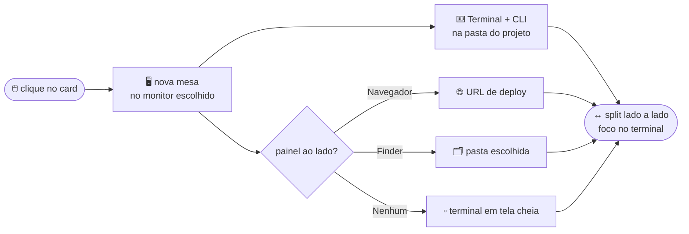

<div align="center">


# loadcli

### Seu ambiente de desenvolvimento inteiro — em **um clique**.

Escolha um projeto e o `loadcli` monta a cena: uma **mesa nova** no monitor certo, o **Terminal** já rodando seu **CLI** na pasta do projeto e, ao lado, **o que aquele projeto precisar** — o navegador no deploy, uma pasta no Finder, ou nada. Tudo posicionado, sem você tocar em nada.

[English](README.md) · **Português** · [中文](README.zh-CN.md)


</div>

---

## 😮‍💨 O tédio que ele resolve

Toda vez que você vai mexer num projeto é o mesmo ritual: abrir o Terminal, `cd` na pasta certa, subir o CLI, abrir o navegador no deploy, criar uma área de trabalho nova pra não bagunçar as outras, arrastar e redimensionar janela… multiplicado por **dezenas de projetos**, dez vezes por dia.

O `loadcli` transforma esse ritual em **um clique num card**.

```
┌───────────────────── nova mesa · monitor escolhido ─────────────────────┐
│                                    │                                     │
│     🌐  Navegador (deploy)          │        ⌨️   Terminal + CLI           │
│     🗂️  ou pasta no Finder          │        cd ~/DEV/meu-projeto         │
│     ▫️  ou nada (tela cheia)        │        $ claude                     │
│                                    │                                     │
└────────────────────────────────────┴─────────────────────────────────────┘
        painel à esquerda                    terminal à direita, com o foco
```

---

## 🎬 O que acontece no clique



Cada janela é **verificada** — o `loadcli` confere que ela realmente caiu na mesa nova e corrige se não caiu — e o **foco termina no terminal**, pronto pra você digitar.

---

## ✨ Destaques

- 🖥️ **Uma mesa por projeto** no monitor que você escolher (seletor de monitor quando há 2+ telas).
- ⌨️ **Terminal + CLI** já na pasta certa — Terminal.app ou iTerm.
- 🧩 **Painel lateral escolhível por projeto:**
  - 🌐 **Navegador** na URL de deploy (Chrome, Brave, Edge, Arc, Safari)
  - 🗂️ **Pasta no Finder** — posicionada no split igual ao navegador
  - ▫️ **Nenhum** — pros projetos que só querem o terminal, em tela cheia
- 📁 **Organização em pastas** — agrupe os cards em pastas recolhíveis; mova com um menu.
- 🤖 **CLI por projeto** — Claude Code, Codex ou comando personalizado, com **modelo e _effort_** próprios (ex.: `opus` + `ultracode`).
- ↔️ **Split automático** com proporção ajustável.
- 🧭 **Menu na barra de status** — lance qualquer projeto (agrupado por pasta) sem abrir a janela principal.
- 🩺 `loadcli --doctor` — autoteste do mecanismo de mesas em cada monitor.
- 🍎 **100% nativo** — SwiftUI, ícone próprio, tela Sobre, Ajustes.

---

## 🧠 A parte difícil: criar Spaces **sem desligar o SIP**

Criar uma área de trabalho (Space) por API privada (SkyLight) **não funciona** num app normal do macOS moderno — é por isso que ferramentas como o *yabai* pedem pra você **desligar o SIP**. O `loadcli` foge disso.

Ele cria a mesa **como um humano criaria**: dirige o botão **“+” do Mission Control** pela **API de Acessibilidade**, usando os identificadores estáveis do Dock (`mc.spaces.add`) e mirando o monitor pelo `AXDisplayID` — o mesmo caminho do `hs.spaces` do Hammerspoon. A criação é confirmada por **diff de IDs de space** (SkyLight, só leitura).

Pra **entrar** na mesa nova (o clique de Acessibilidade no thumbnail é ignorado no macOS 26, e a troca por API privada sobrepõe as telas), ele de novo faz o que uma pessoa faria: um **clique real** no thumbnail da mesa no Mission Control — transição limpa, foco no monitor certo — **sempre verificando** o resultado.

> **SIP fica intacto. Nenhum daemon. Nenhum hack de kernel.** Só Acessibilidade e Apple Events — as mesmas permissões que você concede a qualquer app de automação.

Detalhes em [`docs/ARCHITECTURE.md`](docs/ARCHITECTURE.md).

---

## 🚀 Começando

**Pré-requisitos:** macOS 14+, **Xcode** e **Homebrew**.

> 🧪 **Testado no macOS 26.3 (Tahoe).** O *deployment target* é o macOS 14, mas o fluxo de criação de mesas só foi validado no macOS 26 — no 14/15 as entranhas do Mission Control mudam, então o comportamento lá não é verificado.

```bash
git clone https://github.com/<seu-usuario>/loadcli.git
cd loadcli
make bootstrap     # instala xcodegen, xcbeautify, create-dmg
make run           # gera o projeto, compila e abre o app
```

Na primeira execução o macOS vai pedir **duas permissões** (veja abaixo). Depois, é só clicar em **Adicionar Projeto** e apontar a pasta.

<details>
<summary>Outros alvos do <code>make</code></summary>

```bash
make gen           # gera loadcli.xcodeproj a partir do project.yml
make build         # build Debug
make release       # build Release
make icon          # regenera o ícone do app
make sign-notarize # assina (Developer ID) + notariza + gera o DMG
```
</details>

---

## 🗂️ Configurando um projeto

Cada card guarda tudo o que aquele projeto precisa:

| Campo | O que faz |
|------|-----------|
| **Pasta do projeto** | onde o Terminal dá `cd` |
| **CLI** | Claude Code / Codex / comando personalizado — com **modelo** e **_effort_** |
| **Painel ao lado** | Navegador (URL) · Finder (pasta) · Nenhum |
| **Mesa** | criar nova mesa ou usar a atual |
| **Layout** | terminal à direita/esquerda + proporção do split |
| **Monitor** | fixo ou “perguntar a cada vez” |
| **Pasta (grupo)** | organiza o card numa pasta recolhível |
| **Ícone e cor** | identidade visual do card |

As configs ficam em `~/Library/Application Support/loadcli/` (`projects.json`, `folders.json`, `settings.json`) — versione, faça backup, edite à mão se quiser.

---

## 🔐 Permissões

| Permissão | Pra quê | Onde |
|-----------|---------|------|
| **Acessibilidade** | criar mesas e posicionar janelas | Ajustes › Privacidade e Segurança › **Acessibilidade** |
| **Automação** | controlar Terminal e navegador | o macOS pergunta no 1º uso — clique em *Permitir* |

> Trocou o bundle ID ou recompilou com outra assinatura? O macOS trata como um app novo — basta **re-adicionar** o app em Acessibilidade.

---

## 📦 Distribuição

Publicado como **Developer ID, fora da Mac App Store** — a criação de mesas e o controle de janelas dependem de Acessibilidade/Apple Events **fora do sandbox** da loja.

```bash
# Uma vez: guarde o perfil de notarização (nunca comite segredos)
xcrun notarytool store-credentials loadcli-notary \
  --apple-id "voce@exemplo.com" --team-id "TEAMID" --password "app-specific-password"

export LOADCLI_SIGN_ID="Developer ID Application: Seu Nome (TEAMID)"
export LOADCLI_NOTARY_PROFILE="loadcli-notary"
make sign-notarize     # -> dist/loadcli-<versão>.dmg (assinado, notarizado, stapled)
```

---

## 🛣️ Roadmap

- 🪟 **Windows** — app nativo .NET/WinUI 3 (Virtual Desktops + Win32), compartilhando o schema `projects.json`: [`docs/WINDOWS_ROADMAP.md`](docs/WINDOWS_ROADMAP.md).
- 🔁 Perfis de layout, atalhos globais por projeto, login automático opcional.

---

## 🏗️ Estrutura

```
project.yml                 # definição do projeto (XcodeGen)
Makefile                    # gen / build / run / release / sign-notarize
scripts/                    # bootstrap, gerador de ícone, assinatura/notarização
Sources/loadcli/
  Models/                   # Project, ProjectFolder, AppSettings, Store, AppModel
  Services/                 # SpaceManager, AppLauncher, WindowPositioner, DisplayManager, SkyLight, AX
  Views/                    # SwiftUI — grid + pastas, editores, seletor de monitor, ajustes
  Resources/                # Info.plist, entitlements, Assets (ícone)
docs/                       # arquitetura + roadmap Windows
```

---

## 🤝 Contribuindo

Issues e PRs são bem-vindos. Rode `make build` antes de abrir um PR e descreva o *como testar*. O código segue o idioma da casa: **português** nos textos de UI e comentários.

## 📄 Licença

[MIT](LICENSE) — use, modifique e distribua à vontade, mantendo o aviso de copyright.

<div align="center">
<br>

Feito com ☕ e Mission Control por **HISAYOSHI, N. KAMEDA** · [kameda.app](https://kameda.app)

</div>
