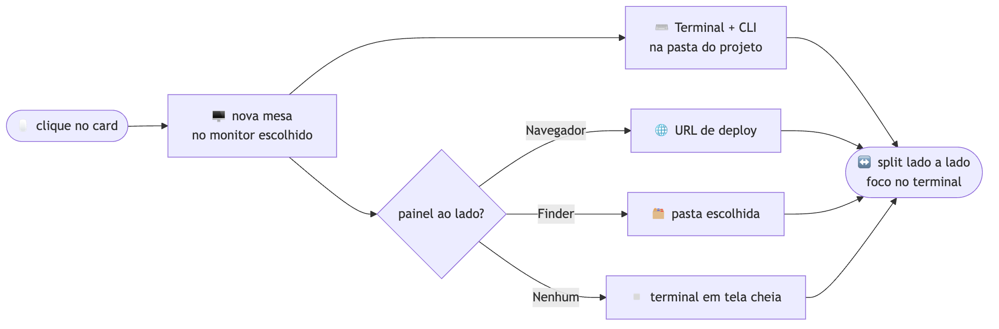

<div align="center">


# loadcli

### Seu ambiente de desenvolvimento inteiro — em **um clique**.

Escolha um projeto e o `loadcli` monta a cena: uma **mesa nova** no monitor certo, o **Terminal** já rodando seu **CLI** na pasta do projeto e, ao lado, **o que aquele projeto precisar** — o navegador no deploy, uma pasta no Finder, ou nada. Tudo posicionado, sem você tocar em nada.

Cada card é um `LOADCLI.md` que mora **dentro da pasta do projeto**, então seus cards viajam junto com suas pastas — sincronize `~/DEV` e todos os seus Macs mostram a mesma grade.

[English](README.md) · **Português** · [中文](README.zh-CN.md)


</div>

---

## 😮‍💨 O tédio que ele resolve

Toda vez que você vai mexer num projeto é o mesmo ritual: abrir o Terminal, `cd` na pasta certa, subir o CLI, abrir o navegador no deploy, criar uma área de trabalho nova pra não bagunçar as outras, arrastar e redimensionar janela… multiplicado por **dezenas de projetos**, dez vezes por dia.

O `loadcli` transforma esse ritual em **um clique num card**.

```
┌───────────────────── nova mesa · monitor escolhido ─────────────────────┐
│                                    │                                     │
│     🌐  Navegador (deploy)          │        ⌨️   Terminal + CLI           │
│     🗂️  ou pasta no Finder          │        cd ~/DEV/meu-projeto         │
│     ▫️  ou nada (tela cheia)        │        $ claude                     │
│                                    │                                     │
└────────────────────────────────────┴─────────────────────────────────────┘
        painel à esquerda                    terminal à direita, com o foco
```

---

## 🎬 O que acontece no clique

<div align="center">



</div>

Cada janela é **verificada** — o `loadcli` confere que ela realmente caiu na mesa nova e corrige se não caiu — e o **foco termina no terminal**, pronto pra você digitar.

---

## ✨ Destaques

- 📄 **Os cards vêm das pastas** — um `LOADCLI.md` dentro de cada pasta de projeto *é* o card. Cadastre suas pastas de projetos uma vez e a grade se monta sozinha, em qualquer máquina.
- 🖥️ **Uma mesa por projeto** no monitor que você escolher (seletor de monitor quando há 2+ telas).
- ⌨️ **Terminal + CLI** já na pasta certa — Terminal.app ou iTerm.
- 🔤 **Aumento de fonte automático** — depois de focar o terminal, pressiona ⌘+ um número de vezes configurável (**1 a 20, padrão 7**) pra fonte não vir minúscula (ajuste em Ajustes).
- 🧩 **Painel lateral escolhível por projeto:**
  - 🌐 **Navegador** na URL de deploy (Chrome, Brave, Edge, Arc, Safari)
  - 🗂️ **Pasta no Finder** — posicionada no split igual ao navegador
  - ▫️ **Nenhum** — só o terminal, **maximizado ou em tela cheia nativa** (mesa própria)
- 🖱️ **Clique seleciona, clique duplo inicia** — e cada card tem botões diretos pra **pasta** do projeto, **site**, **repositório** e editor.
- 🔎 **Busca rápida** — digite e as pastas com resultado se abrem sozinhas; apague e todas fecham de novo.
- 🕘 **Aba Recentes** — os projetos que você abriu por último, do mais novo pro mais antigo.
- 📁 **Organização em pastas** — os grupos vêm da chave `grupo:` do documento; as pastas **abrem sempre fechadas** a cada abertura, pra achar rápido.
- 🤖 **CLI por projeto** — Claude Code, Codex ou comando personalizado, com **modelo e _effort_** próprios (ex.: `opus` + `ultracode`).
- ↔️ **Split automático** com proporção ajustável.
- 🧭 **Menu na barra de status** — lance qualquer projeto (agrupado por pasta, mais um submenu de Recentes) sem abrir a janela principal.
- 🩺 `loadcli --doctor` — autoteste do mecanismo de mesas em cada monitor.
- 🍎 **100% nativo** — SwiftUI, ícone próprio, tela Sobre, Ajustes.

---

## 📄 O card mora dentro da pasta do projeto

Não existe um banco central de projetos. Cada projeto carrega um **`LOADCLI.md`** na própria pasta, e esse arquivo *é* o card. Em **Ajustes › Pastas de projetos** você cadastra as raízes onde guarda código (`~/DEV`, uma pasta do Drive, o que for); o `loadcli` percorre essas pastas, encontra os documentos e monta a grade a partir do que está escrito neles.

```markdown
---
loadcli: 1
id: 6C0F2A18-3D4B-4E71-9A02-1F5C8B3E77D9
nome: Acme Site
grupo: Clientes
icone: cart.fill
cor: "#3B82F6"
repositorio: https://github.com/voce/acme
url: https://app.acme.com
cli: claude
modelo: opus
esforco: xhigh
painel: browser
---

Loja da Acme. Deploy pela Vercel, banco no Neon.
```

- **Nenhum caminho absoluto é gravado.** A pasta do projeto é simplesmente onde o documento está — então o mesmo arquivo funciona em qualquer Mac, com qualquer nome de usuário.
- **Feito pra sincronizar.** Coloque `~/DEV` no Google Drive ou ownCloud e todas as máquinas mostram os mesmos cards, sempre atualizados. Nada pra cadastrar duas vezes.
- **O arquivo é seu.** Chaves que você acrescentar à mão e o corpo em markdown (que vira a descrição do card) sobrevivem a qualquer regravação. Os nomes das chaves são aceitos em português e em inglês.
- **Rápido em toda abertura, menos na primeira.** A última varredura fica em cache, então a janela aparece na hora e a busca no disco roda em segundo plano — os cards novos surgem um instante depois.
- **Nada some.** Uma raiz que não puder ser lida (um Drive que ainda não sincronizou) mantém os cards do cache em vez de esvaziar a grade.

Excluir um card manda o `LOADCLI.md` dele para o Lixo — a pasta do projeto e tudo dentro dela nunca são tocados.

---

## 🧠 A parte difícil: criar Spaces **sem desligar o SIP**

Criar uma área de trabalho (Space) por API privada (SkyLight) **não funciona** num app normal do macOS moderno — é por isso que ferramentas como o *yabai* pedem pra você **desligar o SIP**. O `loadcli` foge disso.

Ele cria a mesa **como um humano criaria**: dirige o botão **“+” do Mission Control** pela **API de Acessibilidade**, usando os identificadores estáveis do Dock (`mc.spaces.add`) e mirando o monitor pelo `AXDisplayID` — o mesmo caminho do `hs.spaces` do Hammerspoon. A criação é confirmada por **diff de IDs de space** (SkyLight, só leitura).

Pra **entrar** na mesa nova (o clique de Acessibilidade no thumbnail é ignorado no macOS 26, e a troca por API privada sobrepõe as telas), ele de novo faz o que uma pessoa faria: um **clique real** no thumbnail da mesa no Mission Control — transição limpa, foco no monitor certo — **sempre verificando** o resultado.

> **SIP fica intacto. Nenhum daemon. Nenhum hack de kernel.** Só Acessibilidade e Apple Events — as mesmas permissões que você concede a qualquer app de automação.

Detalhes em [`docs/ARCHITECTURE.md`](docs/ARCHITECTURE.md).

---

## 🚀 Começando

**Pré-requisitos:** macOS 14+, **Xcode** e **Homebrew**.

> 🧪 **Testado no macOS 26.3 (Tahoe).** O *deployment target* é o macOS 14, mas o fluxo de criação de mesas só foi validado no macOS 26 — no 14/15 as entranhas do Mission Control mudam, então o comportamento lá não é verificado.

```bash
git clone https://github.com/<seu-usuario>/loadcli.git
cd loadcli
make bootstrap     # instala xcodegen, xcbeautify, create-dmg
make run           # gera o projeto, compila e abre o app
```

Na primeira execução o macOS vai pedir **duas permissões** (veja abaixo). Depois, abra **Ajustes › Pastas de projetos**, adicione a pasta onde seu código mora (`~/DEV`, por exemplo) e os cards aparecem sozinhos — ou clique em **Novo Projeto** pra criar a pasta, gravar o `LOADCLI.md` e abrir o terminal nela, tudo de uma vez.

> Vindo de uma versão anterior? A primeira abertura migra sozinha: um `LOADCLI.md` é gravado em cada pasta de projeto cadastrada, as raízes de varredura são deduzidas delas, e os antigos `projects.json` / `folders.json` ficam guardados como `.bak`.

<details>
<summary>Outros alvos do <code>make</code></summary>

```bash
make gen           # gera loadcli.xcodeproj a partir do project.yml
make build         # build Debug
make release       # build Release
make icon          # regenera o ícone do app
make sign-notarize # assina (Developer ID) + notariza + gera o DMG
```
</details>

---

## 🗂️ Configurando um projeto

Cada card guarda tudo o que aquele projeto precisa:

| Campo | Chave no documento | O que faz |
|------|------|-----------|
| **Pasta do projeto** | — (onde o arquivo está) | onde o Terminal dá `cd` |
| **Descrição** | corpo em markdown | aparece no card, em duas linhas |
| **Repositório** | `repositorio` | abre o repo; lido do `.git/config` quando deixado em branco |
| **Site** | `url` | abre a URL de deploy |
| **CLI** | `cli`, `modelo`, `esforco` | Claude Code / Codex / comando personalizado — com **modelo** e **_effort_** |
| **Painel ao lado** | `painel` | Navegador (URL) · Finder (pasta) · Nenhum |
| **Mesa** | `mesa` | criar nova mesa ou usar a atual |
| **Layout** | `lado`, `divisao` | terminal à direita/esquerda + proporção do split |
| **Pasta (grupo)** | `grupo` | organiza o card numa pasta recolhível |
| **Ícone e cor** | `icone`, `cor` | identidade visual do card |
| **Monitor** | *local da máquina* | fixo ou “perguntar a cada vez” — nunca vai para o documento |

Tudo que descreve o projeto viaja no `LOADCLI.md` dele. O que fica só neste Mac mora em `~/Library/Application Support/loadcli/`:

| Arquivo | O que guarda |
|------|------|
| `settings.json` | preferências e a lista de pastas de projetos a varrer |
| `index.json` | cache da última varredura — é o que faz a janela abrir na hora |
| `folders.json` | ícone/cor/ordem de cada grupo, por nome |
| `local.json` | monitor escolhido por projeto e o histórico de Recentes |

---

## 🔐 Permissões

| Permissão | Pra quê | Onde |
|-----------|---------|------|
| **Acessibilidade** | criar mesas e posicionar janelas | Ajustes › Privacidade e Segurança › **Acessibilidade** |
| **Automação** | controlar Terminal e navegador | o macOS pergunta no 1º uso — clique em *Permitir* |

> Trocou o bundle ID ou recompilou com outra assinatura? O macOS trata como um app novo — basta **re-adicionar** o app em Acessibilidade.

---

## 📦 Distribuição

Publicado como **Developer ID, fora da Mac App Store** — a criação de mesas e o controle de janelas dependem de Acessibilidade/Apple Events **fora do sandbox** da loja.

```bash
# Uma vez: guarde o perfil de notarização (nunca comite segredos)
xcrun notarytool store-credentials loadcli-notary \
  --apple-id "voce@exemplo.com" --team-id "TEAMID" --password "app-specific-password"

export LOADCLI_SIGN_ID="Developer ID Application: Seu Nome (TEAMID)"
export LOADCLI_NOTARY_PROFILE="loadcli-notary"
make sign-notarize     # -> dist/loadcli-<versão>.dmg (assinado, notarizado, stapled)
```

---

## 🛣️ Roadmap

- 🪟 **Windows** — app nativo .NET/WinUI 3 (Virtual Desktops + Win32), lendo exatamente os mesmos arquivos `LOADCLI.md`: [`windows/ROADMAP.md`](windows/ROADMAP.md).
- 🔁 Perfis de layout, atalhos globais por projeto, login automático opcional.

---

## 🏗️ Estrutura

```
mac/                        # o app macOS — rode o make aqui dentro (ou na raiz)
  project.yml               # definição do projeto (XcodeGen)
  Makefile                  # gen / build / run / release / sign-notarize
  scripts/                  # bootstrap, gerador de ícone, assinatura/notarização
  Sources/loadcli/
    Models/                 # Project, ProjectDoc (LOADCLI.md), ProjectFolder, LocalPrefs,
                            # AppSettings, LegacyMigration, Store, AppModel
    Services/               # ProjectScanner, SpaceManager, AppLauncher, WindowPositioner,
                            # DisplayManager, SkyLight, AX
    Views/                  # SwiftUI — busca + abas, grid + pastas, editores, ajustes
    Resources/              # Info.plist, entitlements, Assets (ícone)
windows/                    # o port Windows — por enquanto só o roadmap
website/                    # loadcli.com — estático, quatro idiomas
docs/                       # arquitetura + o formato do LOADCLI.md
Makefile                    # atalhos que delegam para mac/ e website/
```

---

## 🤝 Contribuindo

Issues e PRs são bem-vindos. Rode `make build` antes de abrir um PR e descreva o *como testar*. O código segue o idioma da casa: **português** nos textos de UI e comentários.

## 📄 Licença

[MIT](LICENSE) — use, modifique e distribua à vontade, mantendo o aviso de copyright.

<div align="center">
<br>

Feito com ☕ e Mission Control por **HISAYOSHI, N. KAMEDA** · [kameda.app](https://kameda.app)

</div>
