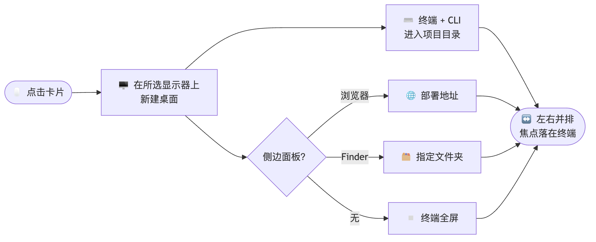

<div align="center">


# loadcli

### 你的整个开发环境 —— **一键**就位。

选中一个项目，`loadcli` 就会为你搭好舞台：在指定显示器上新建一个**桌面（Space）**，让**终端**在项目目录里直接运行你的 **CLI**，并在旁边打开**这个项目需要的东西** —— 部署地址的浏览器、一个 Finder 文件夹，或者什么都不开。全部自动摆好位置，你什么都不用动。

[English](README.md) · [Português](README.pt-BR.md) · **中文**


</div>

---

## 😮‍💨 它替你省掉的琐事

每次开始动一个项目都是同一套流程：打开终端、`cd` 到正确的目录、启动 CLI、打开部署地址的浏览器、新建一个桌面免得弄乱其他的、拖动并调整窗口大小…… 再乘以**几十个项目**、一天十几次。

`loadcli` 把这套流程变成**点一下卡片**。

```
┌───────────────────── 新桌面 · 所选显示器 ───────────────────────┐
│                                    │                                     │
│     🌐  浏览器（部署地址）           │        ⌨️   终端 + CLI               │
│     🗂️  或 Finder 文件夹            │        cd ~/DEV/my-project          │
│     ▫️  或什么都不开（全屏）         │        $ claude                     │
│                                    │                                     │
└────────────────────────────────────┴─────────────────────────────────────┘
        面板在左侧                          终端在右侧，并获得焦点
```

---

## 🎬 点击后发生了什么

<div align="center">



</div>

每个窗口都会被**验证** —— `loadcli` 会确认它确实落在了新桌面上，如果没有就纠正 —— 并且**焦点最终停在终端上**，你可以立刻开始输入。

---

## ✨ 亮点

- 📄 **卡片来自文件夹本身** —— 每个项目文件夹里的一个 `LOADCLI.md` 就*是*那张卡片。项目文件夹只需登记一次，网格便会自动生成，在任何一台机器上都是如此。
- 🖥️ **每个项目一个桌面**，开在你选择的显示器上（有 2 块以上屏幕时提供显示器选择器）。
- ⌨️ **终端 + CLI** 直接进入正确目录 —— 支持 Terminal.app 或 iTerm。
- 🔤 **自动放大字体** —— 聚焦终端后，自动按 ⌘+ 若干次（**1–20，默认 7**），字体不再太小（在“设置”里调整）。
- 🧩 **每个项目可选的侧边面板：**
  - 🌐 **浏览器**打开部署地址（Chrome、Brave、Edge、Arc、Safari）
  - 🗂️ **一个 Finder 文件夹** —— 像浏览器一样并排摆放
  - ▫️ **无** —— 只开终端，**最大化或原生全屏**（独立 Space）
- 🖱️ **单击选中，双击启动** —— 每张卡片还有直达按钮：项目**文件夹**、**网站**、**仓库**和编辑器。
- 🔎 **快速搜索** —— 边输入，含有匹配结果的文件夹会自动展开；清空搜索，它们又全部折叠。
- 🕘 **“最近”标签页** —— 最近打开过的项目，从新到旧。
- 📁 **文件夹归类** —— 分组来自文档里的 `grupo:` 键；文件夹**每次启动都默认折叠**，方便快速查找。
- 🤖 **每个项目独立的 CLI** —— Claude Code、Codex 或自定义命令，各自带有独立的**模型和 _effort_**（例如 `opus` + `ultracode`）。
- ↔️ **自动分屏**，比例可调。
- 🧭 **菜单栏启动器** —— 无需打开主窗口即可启动任意项目（按文件夹分组，另有“最近”子菜单）。
- 🩺 `loadcli --doctor` —— 在每块显示器上对桌面机制做自检。
- 🍎 **100% 原生** —— SwiftUI、专属图标、关于面板、设置。

---

## 📄 卡片就住在项目文件夹里

没有集中的项目数据库。每个项目在自己的文件夹里带着一个 **`LOADCLI.md`**，那个文件就*是*卡片。在**设置 › 项目文件夹**里登记你放代码的根目录（`~/DEV`、某个云盘文件夹，随你），`loadcli` 会遍历它们，找出这些文档，并按文档里写的内容生成网格。

```markdown
---
loadcli: 1
id: 6C0F2A18-3D4B-4E71-9A02-1F5C8B3E77D9
nome: Acme Site
grupo: 客户
icone: cart.fill
cor: "#3B82F6"
repositorio: https://github.com/you/acme
url: https://app.acme.com
cli: claude
modelo: opus
esforco: xhigh
painel: browser
---

Acme 的商店。部署在 Vercel，数据库在 Neon。
```

- **绝不写入绝对路径。** 项目文件夹就是文档所在之处 —— 所以同一个文件在任何 Mac、任何用户名下都能用。
- **天生适合同步。** 把 `~/DEV` 放进 Google Drive 或 ownCloud，每台机器都会显示同一份、始终最新的卡片。无需重复登记。
- **文件属于你。** 你手工添加的键，以及 markdown 正文（它会成为卡片的描述），在每次重写后都会保留。键名支持葡萄牙语和英语两种写法。
- **除了第一次，每次都很快。** 上一次扫描会被缓存，因此窗口瞬间打开，磁盘遍历在后台进行 —— 稍后你会看到新卡片浮现。
- **不会凭空消失。** 读不到的根目录（比如尚未同步完成的云盘）会保留缓存中的卡片，而不是清空网格。

删除一张卡片只是把它的 `LOADCLI.md` 移到废纸篓 —— 项目文件夹及其中的一切都不会被触碰。

---

## 🧠 难点：**不关闭 SIP** 也能创建 Space

在现代 macOS 的普通 App 里，通过私有 API（SkyLight）创建桌面（Space）**是行不通的** —— 这正是 *yabai* 之类的工具要你**关闭 SIP** 的原因。`loadcli` 绕开了它。

它**像人一样**创建桌面：通过**辅助功能（Accessibility）API** 驱动 **Mission Control 的“+”按钮**，使用 Dock 的稳定标识符（`mc.spaces.add`），并按 `AXDisplayID` 定位显示器 —— 与 Hammerspoon 的 `hs.spaces` 走的是同一条路。创建结果通过 **space ID 差异比对**（SkyLight，只读）来确认。

要**进入**新桌面（在 macOS 26 上，对缩略图的辅助功能点击会被忽略，而用私有 API 切换又会让画面重叠），它同样做人会做的事：在 Mission Control 里对该桌面缩略图执行一次**真实点击** —— 干净的切换、焦点落在正确的显示器上 —— 并且**始终验证**结果。

> **SIP 保持开启。没有守护进程。没有内核 hack。** 只用辅助功能和 Apple Events —— 就是你给任何自动化 App 的那几项权限。

细节见 [`docs/ARCHITECTURE.md`](docs/ARCHITECTURE.md)。文档格式的完整说明见 [`docs/FORMATO-LOADCLI-MD.md`](docs/FORMATO-LOADCLI-MD.md)。

---

## 🚀 快速开始

**前置要求：** macOS 14+、**Xcode** 和 **Homebrew**。

> 🧪 **已在 macOS 26.3（Tahoe）上测试。** 部署目标是 macOS 14，但桌面创建流程只在 macOS 26 上验证过 —— 在 14/15 上 Mission Control 的内部实现不同，因此那里的行为未经验证。

```bash
git clone https://github.com/<your-user>/loadcli.git
cd loadcli
make bootstrap     # 安装 xcodegen、xcbeautify、create-dmg
make run           # 生成工程、编译并打开 App
```

首次运行时 macOS 会请求**两项权限**（见下文）。之后打开**设置 › 项目文件夹**，添加你放代码的目录（比如 `~/DEV`），卡片就会自行出现 —— 或者点击**新建项目**，一步完成创建文件夹、写入 `LOADCLI.md` 并在其中打开终端。

> 从旧版本升级？首次启动会自动迁移：在每个已登记的项目文件夹里写入一个 `LOADCLI.md`，据此推导出扫描根目录，旧的 `projects.json` / `folders.json` 则保留为 `.bak`。

<details>
<summary>其他 <code>make</code> 目标</summary>

```bash
make gen           # 从 project.yml 生成 loadcli.xcodeproj
make build         # Debug 构建
make release       # Release 构建
make icon          # 重新生成 App 图标
make sign-notarize # 签名（Developer ID）+ 公证 + 生成 DMG
```
</details>

---

## 🗂️ 配置一个项目

每张卡片都保存着这个项目需要的一切：

| 字段 | 文档中的键 | 作用 |
|------|------|-----------|
| **项目文件夹** | —（文件所在之处） | 终端 `cd` 进入的目录 |
| **描述** | markdown 正文 | 显示在卡片上，最多两行 |
| **仓库** | `repositorio` | 打开仓库；留空时自动从 `.git/config` 读取 |
| **网站** | `url` | 打开部署地址 |
| **CLI** | `cli`、`modelo`、`esforco` | Claude Code / Codex / 自定义命令 —— 带**模型**和 **_effort_** |
| **侧边面板** | `painel` | 浏览器（URL）· Finder（文件夹）· 无 |
| **桌面** | `mesa` | 新建一个桌面，或使用当前桌面 |
| **布局** | `lado`、`divisao` | 终端在右/左 + 分屏比例 |
| **文件夹（分组）** | `grupo` | 把卡片归入一个可折叠的文件夹 |
| **图标与颜色** | `icone`、`cor` | 卡片的视觉标识 |
| **显示器** | *本机专属* | 固定，或“每次询问” —— 绝不写入文档 |

描述项目的一切都随它的 `LOADCLI.md` 一起走。只属于这台 Mac 的东西放在 `~/Library/Application Support/loadcli/`：

| 文件 | 内容 |
|------|------|
| `settings.json` | 偏好设置，以及要扫描的项目文件夹列表 |
| `index.json` | 上一次扫描的缓存 —— 窗口能瞬间打开靠的就是它 |
| `folders.json` | 每个分组的图标/颜色/顺序，按名称索引 |
| `local.json` | 每个项目选定的显示器，以及“最近”历史 |

---

## 🔐 权限

| 权限 | 用途 | 位置 |
|-----------|---------|------|
| **辅助功能** | 创建桌面并摆放窗口 | 设置 › 隐私与安全性 › **辅助功能** |
| **自动化** | 控制终端和浏览器 | macOS 首次使用时询问 —— 点击*允许* |

> 改了 bundle ID 或用不同的签名重新编译了？macOS 会把它当成一个新 App —— 只需在“辅助功能”里**重新添加**该 App。

---

## 📦 分发

以 **Developer ID 形式分发，不上 Mac App Store** —— 创建桌面和控制窗口需要在商店沙盒**之外**使用辅助功能 / Apple Events。

```bash
# 一次性：保存公证配置（切勿提交任何密钥）
xcrun notarytool store-credentials loadcli-notary \
  --apple-id "you@example.com" --team-id "TEAMID" --password "app-specific-password"

export LOADCLI_SIGN_ID="Developer ID Application: Your Name (TEAMID)"
export LOADCLI_NOTARY_PROFILE="loadcli-notary"
make sign-notarize     # -> dist/loadcli-<版本>.dmg（已签名、已公证、已装订）
```

---

## 🛣️ 路线图

- 🪟 **Windows** —— 原生 .NET/WinUI 3 应用（虚拟桌面 + Win32），读取完全相同的 `LOADCLI.md` 文件：[`windows/ROADMAP.md`](windows/ROADMAP.md)。
- 🔁 布局预设、每个项目的全局快捷键、可选的自动登录。

---

## 🏗️ 结构

```
mac/                        # macOS App —— 在这里面（或在仓库根目录）执行 make
  project.yml               # 工程定义（XcodeGen）
  Makefile                  # gen / build / run / release / sign-notarize
  scripts/                  # 引导脚本、图标生成、签名/公证
  Sources/loadcli/
    Models/                 # Project、ProjectDoc（LOADCLI.md）、ProjectFolder、LocalPrefs、
                            # AppSettings、LegacyMigration、Store、AppModel
    Services/               # ProjectScanner、SpaceManager、AppLauncher、WindowPositioner、
                            # DisplayManager、SkyLight、AX
    Views/                  # SwiftUI —— 搜索 + 标签页、网格 + 文件夹、编辑器、设置
    Resources/              # Info.plist、entitlements、Assets（图标）
windows/                    # Windows 移植 —— 目前只有路线图
website/                    # loadcli.com —— 静态站点，四种语言
docs/                       # 架构 + LOADCLI.md 格式说明
Makefile                    # 转发到 mac/ 和 website/ 的快捷方式
```

---

## 🤝 参与贡献

欢迎提交 Issue 和 PR。开 PR 前请先运行 `make build`，并说明*如何测试*。代码沿用项目的“母语”：UI 文案和注释使用**葡萄牙语**。

## 📄 许可证

[MIT](LICENSE) —— 可自由使用、修改和分发，保留版权声明即可。

<div align="center">
<br>

由 **HISAYOSHI, N. KAMEDA** 用 ☕ 与 Mission Control 打造 · [kameda.app](https://kameda.app)

</div>
